# Architecture Specifications - People Hub

## 1. System Architecture

### C4 Level 1: System Context

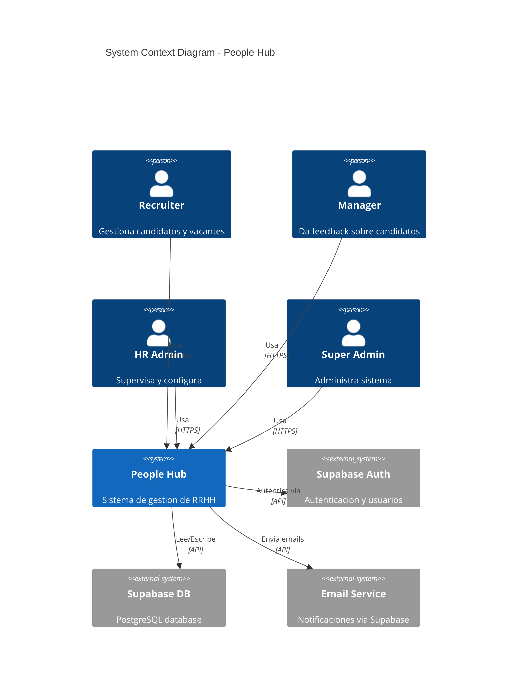

### C4 Level 2: Container Diagram

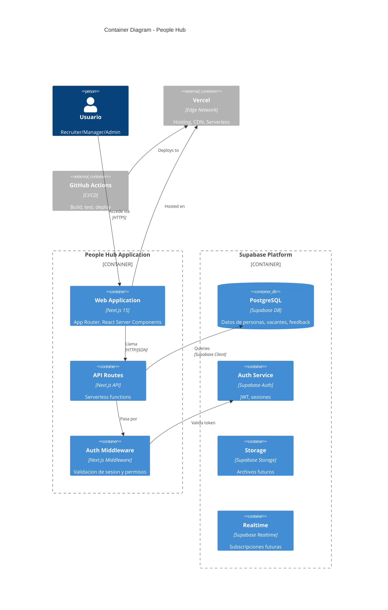

### Component Diagram (Simplified)

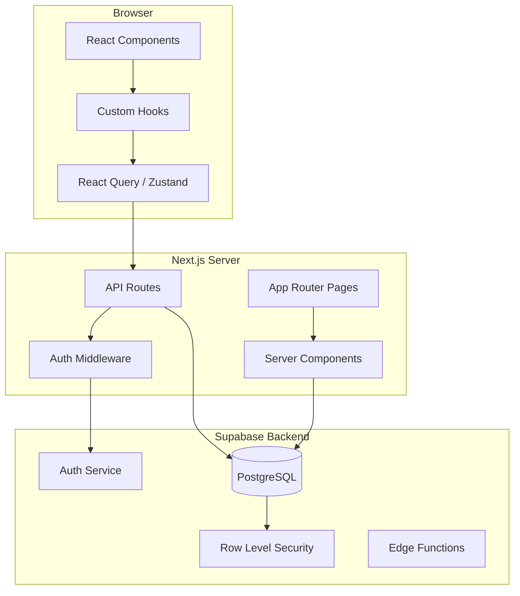

---

## 2. Database Design

### Entity-Relationship Diagram

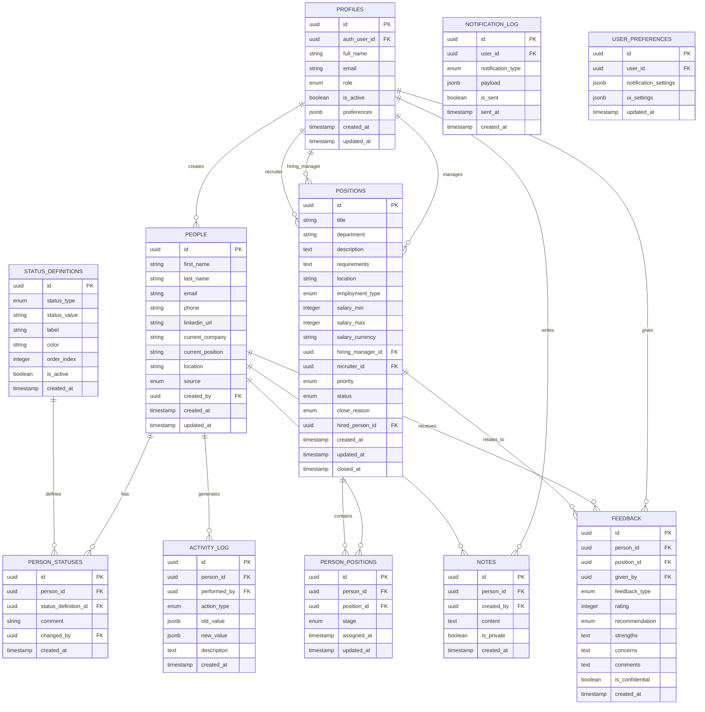

### Schema Notes

**IMPORTANTE:** Este ERD es una guia conceptual. El schema real debe obtenerse via Supabase MCP para asegurar sincronizacion con la base de datos en vivo.

**Indices recomendados:**
- `people(email)` - Busqueda de duplicados
- `people(first_name, last_name)` - Busqueda por nombre
- `person_statuses(person_id, created_at)` - Estado actual
- `person_positions(position_id, stage)` - Pipeline
- `activity_log(person_id, created_at)` - Timeline
- `feedback(person_id, created_at)` - Feedback reciente

**Enums:**
```sql
CREATE TYPE user_role AS ENUM ('recruiter', 'manager', 'hr_admin', 'super_admin');
CREATE TYPE status_type AS ENUM ('candidate', 'employee', 'external');
CREATE TYPE employment_type AS ENUM ('full_time', 'part_time', 'contract', 'internship');
CREATE TYPE position_status AS ENUM ('open', 'on_hold', 'closed');
CREATE TYPE close_reason AS ENUM ('filled', 'cancelled', 'on_hold');
CREATE TYPE pipeline_stage AS ENUM ('applied', 'screening', 'interviewing', 'finalist', 'offer', 'hired', 'rejected');
CREATE TYPE feedback_type AS ENUM ('technical', 'cultural', 'final', 'other');
CREATE TYPE recommendation AS ENUM ('strong_yes', 'yes', 'maybe', 'no', 'strong_no');
CREATE TYPE person_source AS ENUM ('linkedin', 'referral', 'job_board', 'direct', 'other');
CREATE TYPE priority AS ENUM ('low', 'medium', 'high', 'urgent');
```

---

## 3. Tech Stack Justification

### Frontend: Next.js 15 (App Router)

| Aspecto | Detalle |
|---------|---------|
| **Por que elegido** | |
| + React Server Components | Mejor performance, menos JS en cliente |
| + File-based routing | DX mejorada, estructura clara |
| + Full-stack framework | API routes integrados, sin backend separado |
| + Vercel optimizado | Deploy zero-config, edge functions |
| + Comunidad activa | Documentacion extensa, soporte |
| **Trade-offs** | |
| - Curva App Router | Diferente a Pages Router, learning curve |
| - Server Components limitations | No hooks, no browser APIs directamente |
| - Frequent updates | Breaking changes entre versiones |

### UI Library: shadcn/ui + Tailwind CSS

| Aspecto | Detalle |
|---------|---------|
| **Por que elegido** | |
| + Componentes accesibles | Radix UI primitives, ARIA built-in |
| + Customizable | Copy-paste, no lock-in |
| + Tailwind integration | Consistencia, design tokens |
| + No bundle size | Solo lo que usas |
| **Trade-offs** | |
| - Mas setup inicial | Configurar cada componente |
| - Consistencia manual | No theme global automatico |

### Backend: Supabase

| Aspecto | Detalle |
|---------|---------|
| **Por que elegido** | |
| + PostgreSQL | Base de datos relacional robusta |
| + Auth integrado | JWT, OAuth, MFA ready |
| + Row Level Security | Permisos a nivel de DB |
| + Real-time ready | Subscripciones para v2 |
| + Free tier generoso | Suficiente para MVP |
| + API auto-generada | PostgREST, menos codigo backend |
| **Trade-offs** | |
| - Vendor lock-in | Migracion costosa a otro provider |
| - RLS complexity | Curva de aprendizaje |
| - Rate limits | Limites en free tier |

### State Management: React Query + Zustand

| Aspecto | Detalle |
|---------|---------|
| **Por que elegido** | |
| + React Query | Server state, caching, refetch automatico |
| + Zustand | Client state simple, no boilerplate |
| + Separation of concerns | Server vs client state claros |
| **Trade-offs** | |
| - Dos librerias | Overhead de aprender ambas |
| - Overkill para MVP simple | Podria ser solo useState/useContext |

### Form Handling: React Hook Form + Zod

| Aspecto | Detalle |
|---------|---------|
| **Por que elegido** | |
| + React Hook Form | Performance, uncontrolled inputs |
| + Zod | Type-safe validation, inference |
| + Integration | RHF resolver para Zod |
| **Trade-offs** | |
| - Zod bundle size | ~12kb minified |
| - Learning curve | Schemas pueden ser complejos |

### Hosting: Vercel

| Aspecto | Detalle |
|---------|---------|
| **Por que elegido** | |
| + Next.js creators | Optimizaciones de primera clase |
| + Edge network | CDN global, bajo latency |
| + Serverless functions | Auto-scaling |
| + Preview deployments | PR previews automaticos |
| + Analytics built-in | Core Web Vitals |
| **Trade-offs** | |
| - Pricing at scale | Puede ser costoso con alto trafico |
| - Cold starts | Serverless latency inicial |
| - Vendor lock-in | Algunas features Vercel-only |

### CI/CD: GitHub Actions

| Aspecto | Detalle |
|---------|---------|
| **Por que elegido** | |
| + Integracion GitHub | Mismo lugar que codigo |
| + Free tier | 2000 min/mes gratis |
| + Marketplace | Actions pre-hechos |
| **Trade-offs** | |
| - YAML verbose | Configuracion puede ser larga |
| - Debugging dificil | Logs no tan claros |

---

## 4. Data Flow

### User Registration Flow

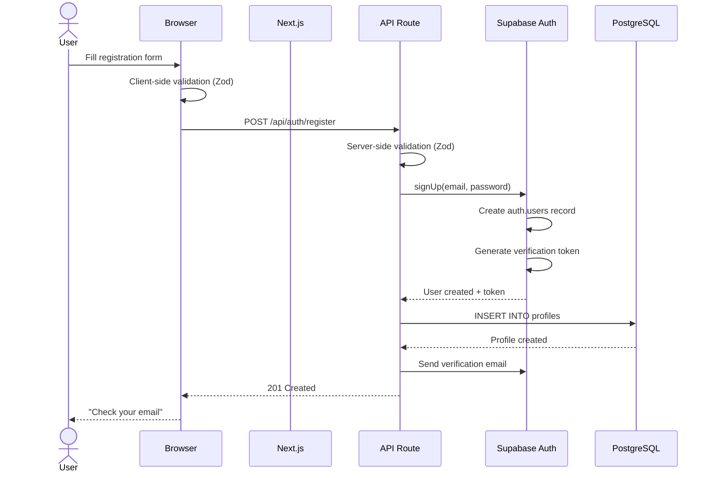

### Create Person Flow

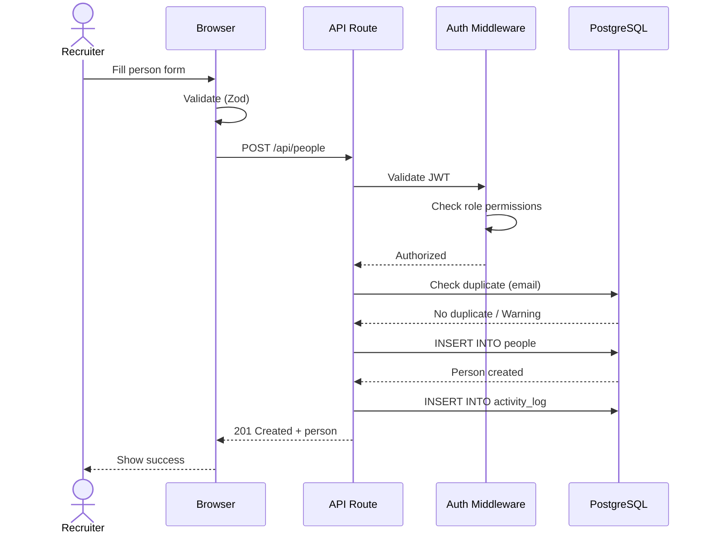

### Give Feedback Flow

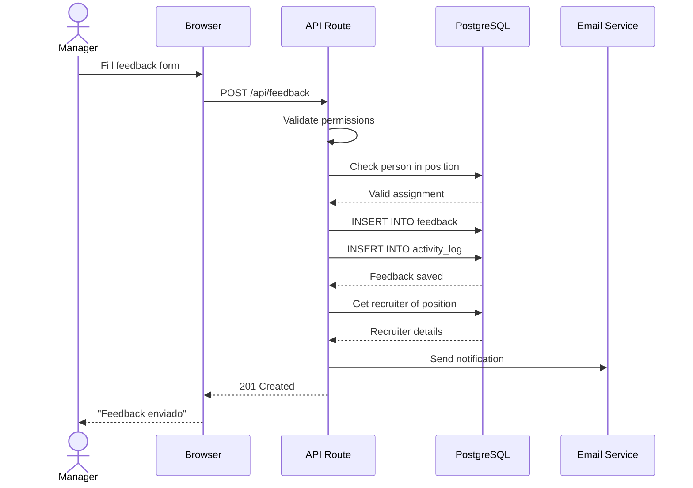

### Search Persons Flow

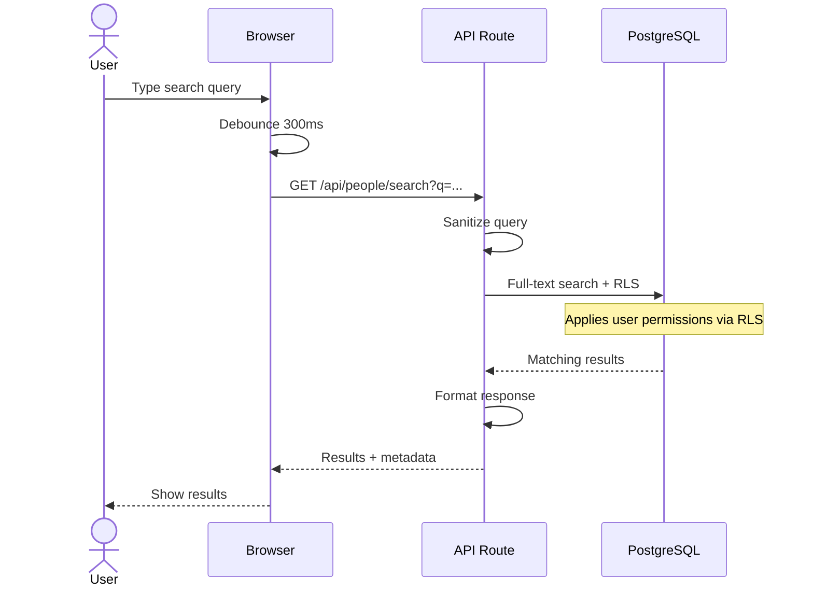

---

## 5. Security Architecture

### Authentication Flow

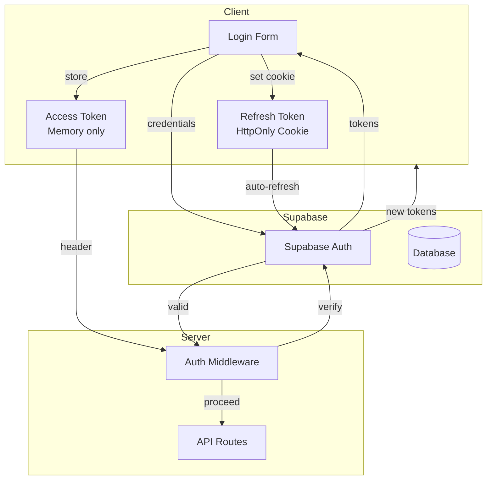

### RBAC Implementation

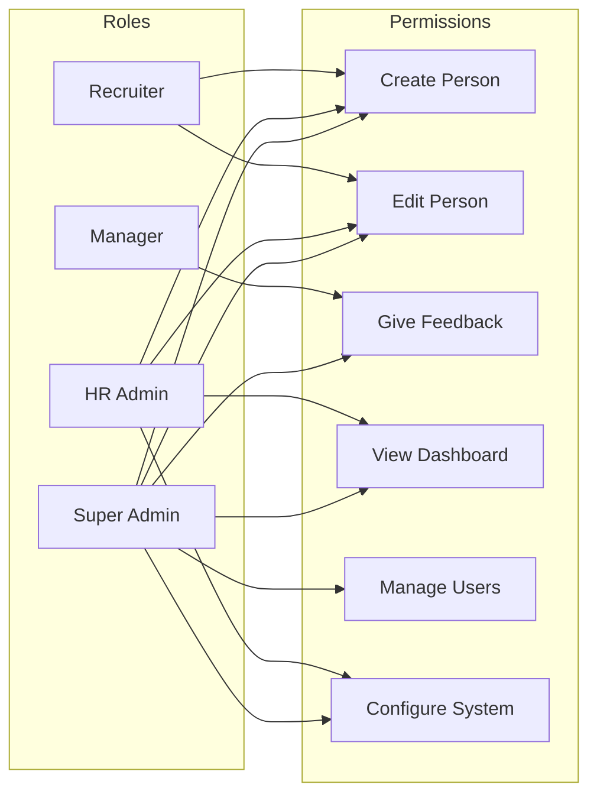

### Row Level Security (RLS)

```sql
-- Example RLS policies (conceptual)

-- Recruiters can see all people
CREATE POLICY "Recruiters can view all people"
ON people FOR SELECT
TO authenticated
USING (
  EXISTS (
    SELECT 1 FROM profiles
    WHERE profiles.auth_user_id = auth.uid()
    AND profiles.role IN ('recruiter', 'hr_admin', 'super_admin')
  )
);

-- Managers can only see people in their positions
CREATE POLICY "Managers can view assigned candidates"
ON people FOR SELECT
TO authenticated
USING (
  EXISTS (
    SELECT 1 FROM profiles p
    WHERE p.auth_user_id = auth.uid()
    AND p.role = 'manager'
    AND EXISTS (
      SELECT 1 FROM person_positions pp
      JOIN positions pos ON pp.position_id = pos.id
      WHERE pp.person_id = people.id
      AND pos.hiring_manager_id = p.id
    )
  )
);

-- Only recruiters/admins can insert people
CREATE POLICY "Recruiters can create people"
ON people FOR INSERT
TO authenticated
WITH CHECK (
  EXISTS (
    SELECT 1 FROM profiles
    WHERE profiles.auth_user_id = auth.uid()
    AND profiles.role IN ('recruiter', 'hr_admin', 'super_admin')
  )
);
```

### Data Protection

| Layer | Protection |
|-------|------------|
| **Transport** | TLS 1.3 (Vercel enforced) |
| **Storage** | AES-256 at rest (Supabase) |
| **Tokens** | JWT signed with RS256 |
| **Passwords** | bcrypt hashing (Supabase Auth) |
| **Queries** | Prepared statements (SQL injection prevention) |
| **Output** | React auto-escaping (XSS prevention) |

---

## 6. Folder Structure

```
people-hub/
├── .context/                    # Context Engineering docs
│   ├── PRD/                     # Product Requirements
│   ├── SRS/                     # Software Requirements
│   └── guidelines/              # Development guidelines
│
├── src/
│   ├── app/                     # Next.js App Router
│   │   ├── (auth)/              # Auth routes group
│   │   │   ├── login/
│   │   │   ├── register/
│   │   │   └── forgot-password/
│   │   │
│   │   ├── (dashboard)/         # Protected routes group
│   │   │   ├── people/
│   │   │   │   ├── [id]/
│   │   │   │   └── new/
│   │   │   ├── positions/
│   │   │   │   ├── [id]/
│   │   │   │   └── new/
│   │   │   ├── dashboard/
│   │   │   └── settings/
│   │   │
│   │   ├── api/                 # API Routes
│   │   │   ├── auth/
│   │   │   ├── people/
│   │   │   ├── positions/
│   │   │   ├── feedback/
│   │   │   └── health/
│   │   │
│   │   ├── layout.tsx
│   │   └── page.tsx
│   │
│   ├── components/
│   │   ├── ui/                  # shadcn/ui components
│   │   ├── forms/               # Form components
│   │   ├── layout/              # Layout components
│   │   └── features/            # Feature-specific components
│   │       ├── people/
│   │       ├── positions/
│   │       └── feedback/
│   │
│   ├── lib/
│   │   ├── supabase/            # Supabase client & utils
│   │   │   ├── client.ts        # Browser client
│   │   │   ├── server.ts        # Server client
│   │   │   └── middleware.ts    # Auth middleware
│   │   ├── validations/         # Zod schemas
│   │   ├── utils/               # Helper functions
│   │   └── constants.ts
│   │
│   ├── hooks/                   # Custom React hooks
│   │   ├── use-people.ts
│   │   ├── use-positions.ts
│   │   └── use-auth.ts
│   │
│   ├── types/                   # TypeScript types
│   │   ├── database.ts          # Generated from Supabase
│   │   └── index.ts
│   │
│   └── styles/
│       └── globals.css
│
├── tests/
│   ├── unit/
│   ├── integration/
│   └── e2e/
│
├── public/
├── supabase/
│   ├── migrations/              # SQL migrations
│   └── seed.sql                 # Test data
│
├── .github/
│   └── workflows/
│       ├── ci.yml
│       └── deploy.yml
│
├── next.config.js
├── tailwind.config.js
├── tsconfig.json
└── package.json
```

---

## 7. Deployment Architecture

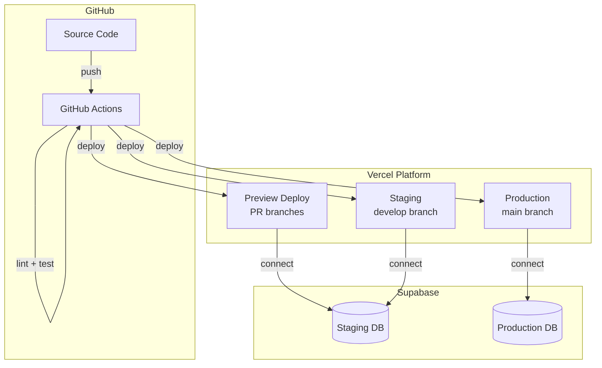

### Environment Variables

| Variable | Development | Staging | Production |
|----------|-------------|---------|------------|
| `NEXT_PUBLIC_SUPABASE_URL` | localhost | staging.supabase.co | prod.supabase.co |
| `NEXT_PUBLIC_SUPABASE_ANON_KEY` | dev-key | staging-key | prod-key |
| `SUPABASE_SERVICE_ROLE_KEY` | dev-key | staging-key | prod-key |
| `NEXT_PUBLIC_APP_URL` | localhost:3000 | staging.app.com | app.com |

---

## Appendix: Decision Log

| Decision | Options Considered | Chosen | Rationale |
|----------|-------------------|--------|-----------|
| Database | PostgreSQL, MySQL, MongoDB | PostgreSQL via Supabase | Relational model fits RRHH domain, RLS for security |
| Auth | Custom, Auth0, Supabase Auth | Supabase Auth | Integrated with DB, free tier, JWT built-in |
| Hosting | AWS, GCP, Vercel | Vercel | Best Next.js integration, preview deploys |
| State | Redux, Zustand, Context | React Query + Zustand | Server/client state separation |
| Styling | CSS Modules, Styled, Tailwind | Tailwind + shadcn | Performance, consistency, accessibility |
| Testing | Jest, Vitest, Playwright | Vitest + Playwright | Speed, ESM support, E2E coverage |

---

*Documento generado para: People Hub MVP*
*Version: 1.0*
*Ultima actualizacion: Fase 2 - Architecture*
